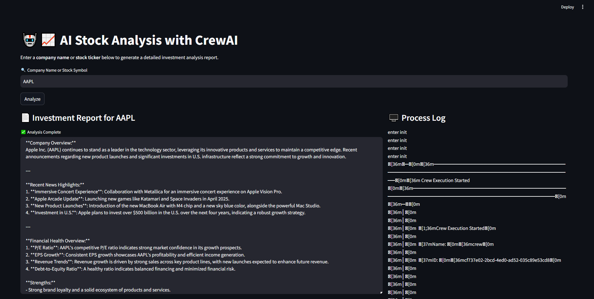

# Stock Analysis with AI Agents — CrewAI

Multi-agent stock analysis system that generates detailed investment reports. Three specialized AI agents (Research Analyst, Financial Analyst, Investment Advisor) collaborate to analyze SEC filings, financial data, and market sentiment.



## How It Works

```
User Input (ticker/company name)
        |
        v
  Research Analyst ──> gathers news, market sentiment, upcoming events
        |
        v
  Financial Analyst ──> analyzes 10-K/10-Q filings, financial metrics, competitors
        |
        v
  Investment Advisor ──> synthesizes everything into a recommendation report
        |
        v
  Final Report (saved to output/)
```

**Agents and their tools:**

| Agent | Role | Tools |
|---|---|---|
| Research Analyst | News, sentiment, events | SEC 10-Q/10-K RAG, Web Scraper |
| Financial Analyst | Financial health, filings | SEC 10-Q/10-K RAG, Web Search, Calculator |
| Investment Advisor | Final recommendation | Web Search, Web Scraper, Calculator |

The agents run sequentially via CrewAI's orchestration — each agent's output feeds into the next.

## Tech Stack

- **Agent Framework:** CrewAI with LangChain
- **LLM:** OpenAI GPT-4o-mini
- **Data Sources:** SEC EDGAR (10-K, 10-Q filings via sec-api), web scraping
- **RAG:** Document embedding + semantic search over SEC filings
- **Frontend:** Streamlit (two modes: simple + real-time agent logs)
- **Infrastructure:** Docker, docker-compose

## Quick Start

### Local

```bash
git clone https://github.com/Vipul111196/stock-analysis-crewai.git
cd stock-analysis-crewai

# Setup
cp .env.example .env    # add your API keys
pip install -r requirements.txt

# CLI mode
make run

# Streamlit UI
make ui

# Streamlit UI with real-time agent logs
make ui-logs
```

### Docker

```bash
cp .env.example .env    # add your API keys
make docker-up          # runs at http://localhost:8501
```

## API Keys Required

| Key | Source | Used For |
|---|---|---|
| `OPENAI_API_KEY` | [OpenAI Platform](https://platform.openai.com/) | LLM for all agents |
| `SEC_API_API_KEY` | [SEC API](https://sec-api.io/) | Fetching 10-K/10-Q filings from EDGAR |

## Project Structure

```
stock-analysis-crewai/
├── src/
│   ├── config/
│   │   ├── agents.yaml          # Agent roles, goals, backstories
│   │   └── tasks.yaml           # Task descriptions and expected outputs
│   ├── tools/
│   │   ├── sec_tools.py         # SEC 10-K/10-Q RAG tools
│   │   └── calculator_tool.py   # Safe arithmetic evaluator
│   ├── crew.py                  # CrewAI orchestration
│   ├── main.py                  # CLI entry point
│   ├── app.py                   # Streamlit UI (simple)
│   ├── app_with_logs.py         # Streamlit UI (with agent logs)
│   └── utils.py                 # Shared ticker resolution logic
├── output/                      # Generated analysis reports
├── images/                      # UI screenshots
├── Dockerfile
├── docker-compose.yml
├── Makefile
├── requirements.txt
└── .env.example
```

## Example Output

Reports are saved to `output/<TICKER>_analysis.txt`. See [AAPL analysis](output/AAPL_analysis.txt) and [MSFT analysis](output/MSFT_analysis.txt) for examples.

Each report covers: financial health, revenue trends, P/E ratio, EPS growth, competitive analysis, insider trading activity, upcoming events, and a final investment recommendation.

## License

MIT
